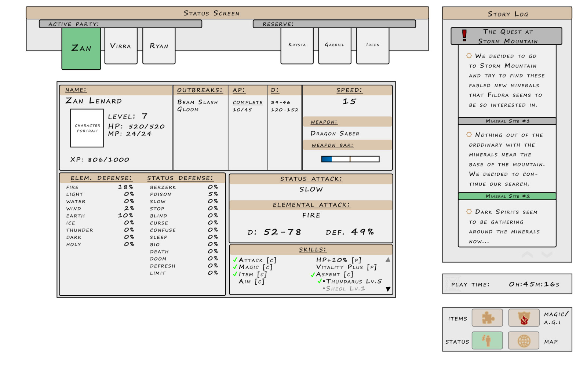

# projectGame1
game using html, css and javascript 

## 

### Wireframe 

##### Loading/Home Game Page (buttons to choose solo, w. comp, w. user)

### Solo page (charcater selection)

### 2 player (comp or user) & (character selection)

### Gameplay solo page (text adventure begins!)

### Gameplay 2 player page (text adventure begins!)

### Solo game win

### 2 player game win

## Game instruction && rules for RPG
1.
2.
3.
4.
5.
6.