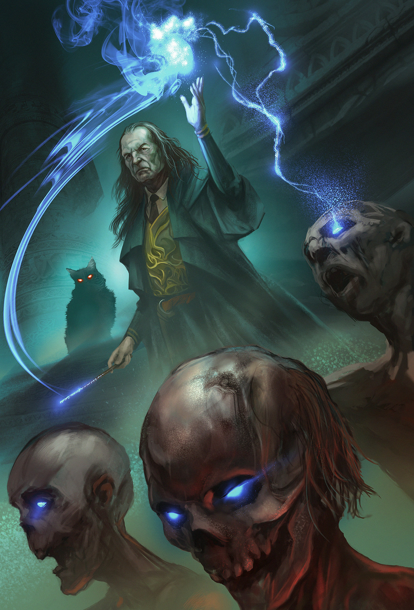

# Tavalon Empire: The New Knight
game using html, css and javascript 

## 

### Wireframe 

##### Loading/Home Game Page (buttons to choose solo, w. comp, w. user)

&

#### Solo page (charcater selection)

 
#### Gameplay solo page (text adventure begins!)

&

#### 2 player (comp or user) & (character selection)

#### 2 player gameplay display

#### Necromancer

#### Warrior

#### Healer

#### Archer 

## Game instruction && rules for "RPG"
1. Must go through village to get to Castle and get knighted.
2. Must make choices that effect the journey outcomes.
3. Must make a choice within a timed manner; countdown varies dependent on situation; choice randomly picked if no selection is made from user ex) battle encounter choice timer set to 15seconds; path/action choice 30 seconds. 
4. Must battle; each character has a special weapon that carries different endings if choice is made to find special weapon along journey (easter egg/NOT NEEDED not win game). *Solo game mode only*
5. Game runs until in castle and knighted by Queen; solo mode will have user meet all other characters outside of character list whether to battle or recruit as an ally. 
6. IF 2 player mode is selected with user, have screen "split" where both sides make a choice within a longer time limit than solo time limits for choices. 
7. IF 2 player mode is selected with computer, just add functionality for computer to randomly make a choice in two cases: 1) when user makes a choice; 2) if user fails to make a choice and it randomizes choice for user. 
8. Game over when die in battle, or did not get knighted. 
9. If 2 player game mode selected, the users cannot be the same character. Example, if user 1 picks Archer, user 2 is left with remaining 3 choices of Healer, Necromancer, and Warrior. 

## Schedule (Objectives/Goals)
### Wednesday
1. Wireframes
2. Pseudo code

### Thursday
1. JS
2. Player objects 

### Friday
1. JS
2. boardGame function! 

### Saturday
1. HTML/CSS

### Sunday
1. HTML/CS + JS

### Monday
1. Tweaks and advance HTML/CSS (animations)

### References/Resource links 

For kingdom name (Tavalon Empire) )
https://www.fantasynamegenerators.com/kingdom-names.php

For character images
https://www.artstation.com/

#### Notes from meeting 

MVP focuses:

styling last;
containers;
skeleton bones of functionality by Saturday;
start with player 2 character selection page and functionality; 
html page start and some css (grid or flexbox) to make skeleton; 
javascript, class/object for each characters to pull from object constructor; 
focus on battling- (2 attack options (example: attack/defend) to be displayed in DOM health/attack power); until one loses. 